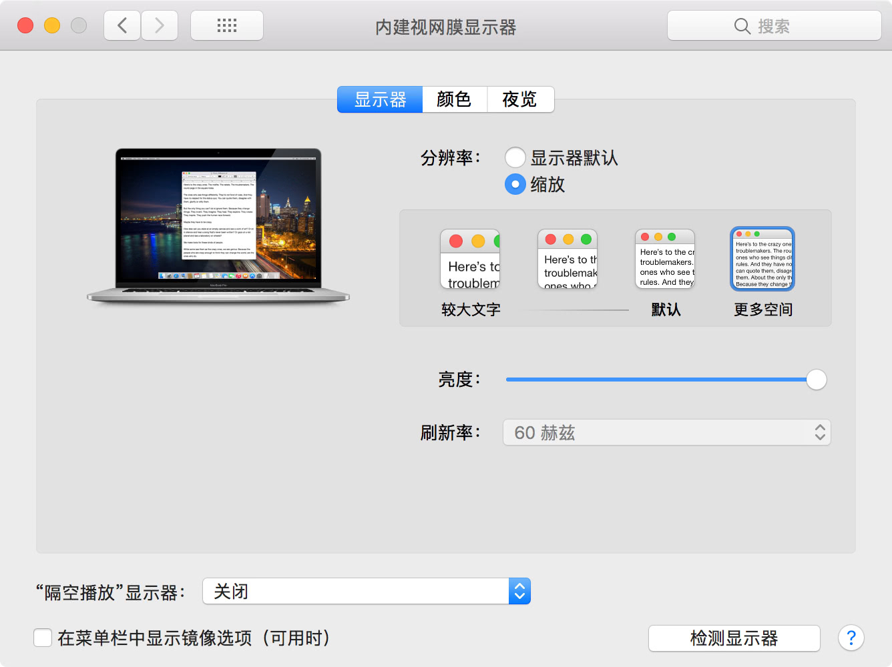
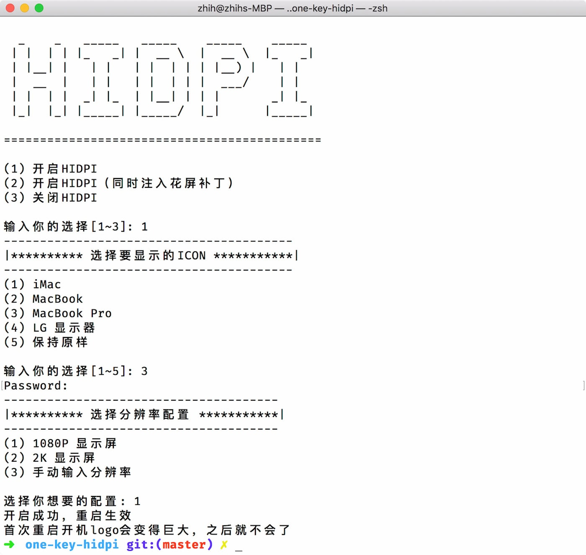

# 一键开启 macOS HiDPI

## 说明

[English](README.md) | [中文](README-zh.md)

 此脚本的目的是为中低分辨率的屏幕开启 HiDPI 选项，并且具有原生的 HiDPI 设置，不需要 RDM 软件即可在系统显示器设置中设置

macOS 的 DPI 机制和 Windows 下不一样，比如 1080p 的屏幕在 Windows 下有 125%、150% 这样的缩放选项，而同样的屏幕在 macOS 下，缩放选项里只是单纯的调节分辨率，这就使得在默认分辨率下字体和UI看起来很小，降低分辨率又显得模糊

同时，此脚本也可以通过注入修补后的 EDID 修复闪屏，或者睡眠唤醒后的闪屏问题，当然这个修复因人而异

**修正Mojave花屏 感谢@Steeeve葫芦娃提供的分辨率参数**

开机的第二阶段 logo 总是会稍微放大，因为分辨率是仿冒的

设置：



## 使用方法

在终端输入以下命令回车即可

```
sh -c "$(curl -fsSL https://raw.githubusercontent.com/daliansky/one-key-hidpi/master/hidpi-zh.sh)"
```



## 恢复

如果使用此脚本后，开机无法进入系统，请到恢复模式中或使用 clover `-x` 安全模式进入系统 ，使用终端删除 `/System/Library/Displays/Contents/Resources/Overrides` 下删除显示器 VendorID 对应的文件夹，并把 backup 文件夹中的备份复制出来。

具体命令如下：

```
$ cd /Volumes/你的系统盘/System/Library/Displays/Contents/Resources/Overrides
$ VendorID=$(ioreg -l | grep "DisplayVendorID" | awk '{print $8}')
$ Vid=$(echo "obase=16;$VendorID" | bc | tr 'A-Z' 'a-z')
$ rm -rf ./DisplayVendorID-$Vid
$ cp -r ./backup/* ./
```

## 从以下得到启发

https://www.tonymacx86.com/threads/solved-black-screen-with-gtx-1070-lg-ultrafine-5k-sierra-10-12-4.219872/page-4#post-1644805

https://github.com/syscl/Enable-HiDPI-OSX

